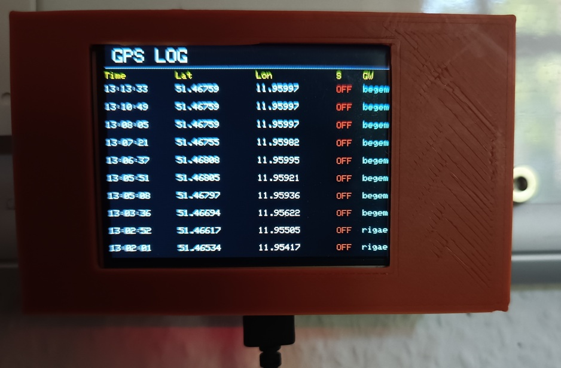

# LoRaWAN GPS-Tracker – Empfänger

## Projektübersicht

Dieser ESP32 dient als **Empfängerstation für einen GPS-Tracker**.

Der GPS-Tracker überträgt seine aktuelle Position über **LoRaWAN** an **The Things Network (TTN)**. Die empfangenen Daten werden von diesem ESP32 über MQTT aus TTN abgerufen, auf einem TFT-Display dargestellt und bei aktiviertem Logging als **GPX-Datei auf einer SD-Karte** gespeichert.

Zusätzlich besitzt der Empfänger einen eigenen WLAN-Hotspot. Über einen Webbrowser können die aufgezeichneten GPX-Tracks angezeigt, heruntergeladen und gelöscht werden. Die Tracks lassen sich direkt auf einer OpenStreetMap-Karte darstellen.

## Systemübersicht

```text
GPS-Tracker
     │
     │ LoRaWAN
     ▼
The Things Network (TTN)
     │
     │ MQTT
     ▼
ESP32 Empfänger
     │
     ├── TFT Display
     │
     ├── SD-Karte
     │      └── GPX-Dateien
     │
     └── WLAN-Hotspot
            │
            ▼
        Webbrowser
            │
            └── OpenStreetMap
```

## Funktionen

### GPS-Daten

Der Empfänger verarbeitet die vom GPS-Tracker übertragenen:

* Latitude
* Longitude
* Logging-Status
* Zeitstempel

Die Position wird auf dem TFT-Display angezeigt.

### TTN / MQTT

Die Kommunikation erfolgt über:

* The Things Network
* MQTT
* ESP32 WLAN

Der ESP32 verbindet sich mit dem WLAN und ruft die Uplink-Daten des Trackers über MQTT ab.

### Gateway-Auswahl

Wenn mehrere TTN-Gateways ein Paket empfangen, werden die empfangenen Gateway-Daten ausgewertet.

Anhand des **RSSI-Wertes** wird das beste empfangende Gateway ausgewählt.

Auf dem Display werden unter anderem angezeigt:

* Gateway
* RSSI
* SNR

Damit lässt sich während einer Fahrt nachvollziehen, über welches Gateway die Daten empfangen wurden.

## TFT-Display

Das TFT-Display zeigt die aktuellen Betriebsdaten des Empfängers.

Beispielsweise:

```text
GPS TRACKER

Zeit: 14:32:18

LAT: 51.482345
LON: 11.970123

LOG: ON

GW: Gateway-Name
RSSI: -87 dBm
SNR: 8.5
```

Die genaue Darstellung hängt von der verwendeten Display-Konfiguration und der aktuellen Softwareversion ab.

## GPX-Logging

Bei aktiviertem Logging werden die empfangenen GPS-Positionen auf der SD-Karte gespeichert.

Das Dateiformat ist **GPX (GPS Exchange Format)** und kann beispielsweise mit Karten- und GPS-Programmen weiterverarbeitet werden.

Die Dateien können später beispielsweise in:

* OpenStreetMap-Anwendungen
* GPX-Trackern
* Kartenprogrammen
* GPS-Software

verwendet werden.

### Dateiname

Die GPX-Dateien werden automatisch anhand von Datum und Uhrzeit benannt.

Dadurch können mehrere Fahrten voneinander getrennt gespeichert werden.

## Weboberfläche

Der ESP32 stellt einen eigenen WLAN-Hotspot zur Verfügung.

Nach dem Verbinden mit dem Hotspot kann die Weboberfläche des Empfängers mit einem Smartphone, Tablet oder PC geöffnet werden.

Die Weboberfläche ermöglicht:

* Anzeige der vorhandenen GPX-Dateien
* Download von GPX-Dateien
* Löschen von GPX-Dateien
* Anzeige eines aufgezeichneten Tracks
* Darstellung des Tracks auf einer Karte

### Kartenanzeige

Die aufgezeichneten GPS-Daten können direkt auf einer **OpenStreetMap-Karte** dargestellt werden.

Die Trackpunkte werden dabei als Streckenverlauf angezeigt.

Zusätzlich können Informationen zum jeweiligen Trackpunkt dargestellt werden, beispielsweise:

* Uhrzeit
* Gateway
* RSSI
* SNR

## WLAN-Hotspot

Der ESP32 arbeitet als eigener Access Point.

Beispiel:

```text
SSID:
ESP32-GPS-Tracker

Passwort:
********
```

Die tatsächlichen Zugangsdaten werden im Sketch festgelegt.

Nach dem Verbinden mit dem ESP32 kann die Weboberfläche über die IP-Adresse des Access Points aufgerufen werden.

Die Standard-IP eines ESP32-SoftAP ist normalerweise:

```text
192.168.4.1
```

## Hardware

### Empfänger

Benötigt werden:

* ESP32
* TFT-Display
* LoRaWAN-fähige WLAN-/MQTT-Anbindung
* SD-Karten-Modul
* SD-Karte

Je nach verwendeter Hardware können zusätzliche Bauteile erforderlich sein.

## Software

Das Projekt wurde für den ESP32 entwickelt und verwendet unter anderem folgende Bibliotheken:

* WiFi
* MQTT
* TFT_eSPI
* SPI
* SD
* LittleFS
* weitere im Sketch aufgeführte Bibliotheken

Die jeweils verwendeten Bibliotheksversionen sollten möglichst mit der Version übereinstimmen, mit der der Sketch entwickelt und getestet wurde.

## TTN-Konfiguration

Der GPS-Tracker muss bei **The Things Network** als LoRaWAN-Gerät eingerichtet sein.

Für den Empfänger werden die MQTT-Zugangsdaten von TTN benötigt.

Im Sketch werden unter anderem folgende Parameter verwendet:

```cpp
mqtt_server
mqtt_port
mqtt_user
mqtt_pass
mqtt_topic
```

### Sicherheit

**Wichtig:**

Passwörter, MQTT-API-Keys und andere Zugangsdaten dürfen nicht in ein öffentliches GitHub-Repository hochgeladen werden.

Vor der Veröffentlichung sollten deshalb alle persönlichen Zugangsdaten aus dem Sketch entfernt werden.

Beispielsweise:

```cpp
const char* ssid = "DEIN_WLAN";
const char* password = "DEIN_PASSWORT";

const char* mqtt_user = "DEIN_TTN_USER";
const char* mqtt_pass = "DEIN_TTN_API_KEY";
```

Die eigenen Zugangsdaten können anschließend lokal wieder eingesetzt werden.

## SD-Karte

Die SD-Karte dient zur Speicherung der aufgezeichneten GPS-Tracks.

Die erzeugten Dateien besitzen das Format:

```text
.gpx
```

Die Dateien können über die Weboberfläche angezeigt und heruntergeladen werden.

## Datenfluss

Ein typischer Datenfluss während einer Fahrt sieht folgendermaßen aus:

```text
GPS-Sender
   │
   │ GPS Position
   ▼
ESP32 GPS Tracker
   │
   │ LoRaWAN
   ▼
LoRaWAN Gateway
   │
   ▼
The Things Network
   │
   │ MQTT
   ▼
ESP32 Empfänger
   │
   ├── TFT-Anzeige
   │
   └── SD-Karte
          │
          ▼
        GPX-Datei
          │
          ▼
      Webbrowser
          │
          ▼
    OpenStreetMap
```

## Einsatzgebiet

Das System eignet sich beispielsweise für:

* GPS-Tracking von Fahrzeugen
* Modellbahn- und Fahrzeugprojekte
* Outdoor-Fahrzeuge
* mobile GPS-Aufzeichnungen
* Tests der LoRaWAN-Reichweite
* Aufzeichnung von Fahrstrecken

## Projektstatus

**Status: Funktionsfähiger Prototyp / getestet**

Der Empfänger wurde zusammen mit dem zugehörigen GPS-LoRaWAN-Sender entwickelt und getestet.

Die Software wird bei Bedarf weiterentwickelt.

## Hinweise

Die Reichweite und Zuverlässigkeit der Datenübertragung hängen unter anderem ab von:

* verwendeter LoRaWAN-Frequenz
* Gateway-Standort
* Antenne
* Sendeleistung
* Umgebung
* Bebauung
* Gelände
* Anzahl erreichbarer Gateways

Für den praktischen Betrieb sollte außerdem auf eine zuverlässige WLAN-Verbindung zwischen Empfänger und MQTT/TTN geachtet werden.

## Zugehöriges Projekt

Der Empfänger ist Bestandteil des Projekts:

**LoRaWAN GPS-Tracker**

Zum Gesamtsystem gehören:

* GPS-Tracker / Sender
* LoRaWAN
* The Things Network
* MQTT
* ESP32-Empfänger
* TFT-Display
* SD-Karte
* GPX-Logging
* Weboberfläche
* OpenStreetMap

---

## Lizenz

Dieses Projekt wird auf GitHub zu Dokumentations- und Entwicklungszwecken veröffentlicht.

Die Verwendung, Änderung und Weiterentwicklung des Codes erfolgt auf eigene Verantwortung.
